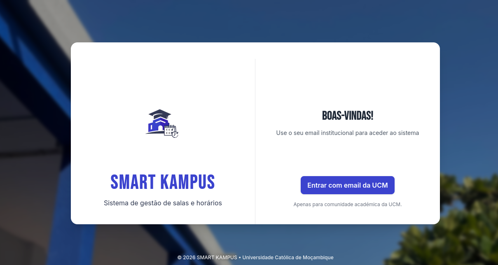
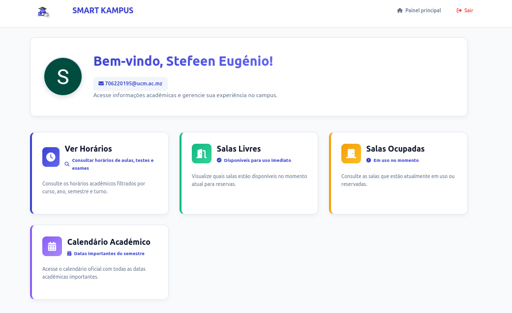
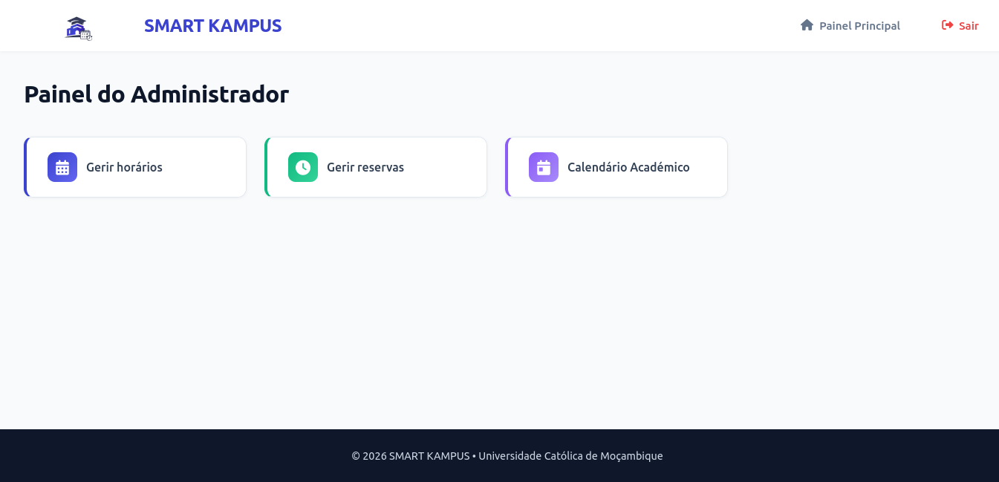
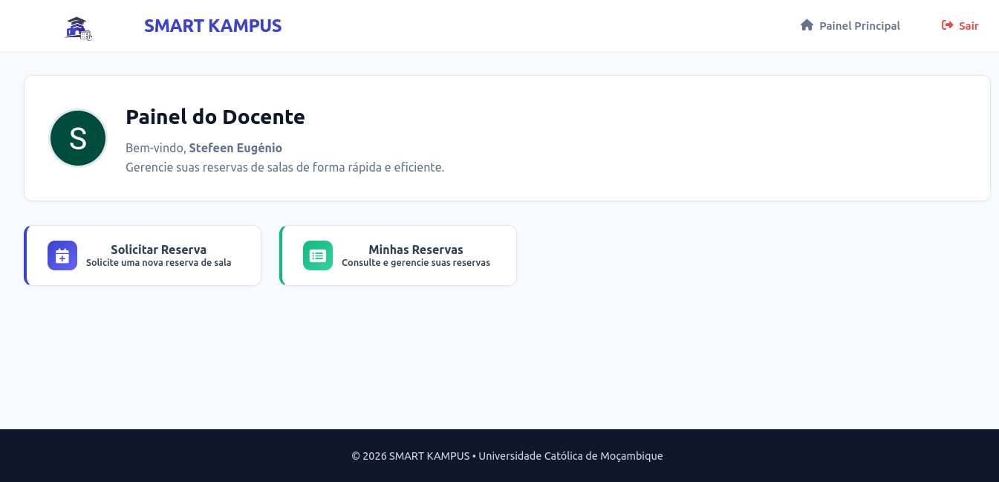

# 🎓 Smart Kampus

> Sistema Web de Gestão de Salas, Horários e Reservas Académicas.

---

## 📌 Sobre o Projeto

O **Smart Kampus** é um sistema web desenvolvido para a FGTI (Faculdade de Gestão de Turismo e Informática), com o objetivo de centralizar e otimizar a gestão académica de horários, reservas de salas e calendário académico.

O sistema permite a administração estruturada das atividades académicas, assegurando maior organização e transparência.

---

## 🎯 Objetivo

O Smart Kampus visa:

- Automatizar a gestão de horários (aulas, testes e exames)
- Controlar e supervisionar reservas de salas
- Permitir visualização em tempo real da ocupação das salas
- Disponibilizar o calendário académico para consulta e download
- Melhorar a eficiência administrativa da instituição

---

## 👥 Perfis de Utilizador

O sistema encontra-se estruturado em três níveis de utilizadores:

---

### 👨‍💼 Administrador

Responsável pela gestão global da plataforma.

**Funcionalidades:**

- Criar, editar e remover:
  - Horários de aulas
  - Testes
  - Exames
- Gerir reservas de salas:
  - Aprovar
  - Rejeitar
  - Cancelar
  - Apagar
- Efetuar upload do calendário académico
- Monitorizar o estado das salas em tempo real

---

### 👨‍🏫 Corpo Docente

Responsável pela gestão das suas próprias reservas.

**Funcionalidades:**

- Solicitar reserva de sala
- Cancelar reservas
- Apagar pedidos de reserva

---

### 👨‍🎓 Estudantes (Utilizadores Comuns)

Possuem acesso de visualização.

**Funcionalidades:**

- Visualizar horários académicos
- Consultar o calendário académico
- Efetuar download do calendário
- Visualizar salas:
  - Livres
  - Ocupadas
  - Estado atualizado em tempo real

---

## 🚀 Funcionalidades Principais

- Sistema de autenticação
- Gestão centralizada de horários
- Sistema de reservas com aprovação administrativa
- Upload e disponibilização do calendário académico
- Visualização dinâmica da ocupação das salas
- Interface responsiva

---

## 📸 Screenshots

### 🔐 Login

### 📊 Painel Principal

### 📊 Painel Administrativo

### 📊 Painel Docente

## 🛠 Tecnologias Utilizadas

- PHP
- MySQL
- JavaScript
- Tailwind | CSS
- Google OAuth 2.0

## ⚙️ Instalação e Execução

Para executar o sistema em ambiente local, siga os passos abaixo:

---

### 1️⃣ Requisitos

Antes de iniciar, certifique-se de que possui instalado:

- XAMPP (Windows) ou LAMPP (Linux)
- PHP 8+
- MySQL
- Composer

---

### 2️⃣ Clonar o Repositório

Clone o projeto para o diretório `htdocs` (caso utilize XAMPP):

git clone https://github.com/stephen-wtx/Smart-Kampus.git

Em seguida, mova a pasta do projeto para:

C:\xampp\htdocs\   (Windows)

ou

/opt/lampp/htdocs/   (Linux)

---

### 3️⃣ Iniciar o Servidor

Abra o XAMPP/LAMPP e inicie:

- Apache
- MySQL

---

### 4️⃣ Configurar a Base de Dados

1. Aceda a:
   http://localhost/phpmyadmin

2. Importe o ficheiro SQL localizado na pasta do projeto (ex: `/bd/smartkampus.sql`)

---

### 5️⃣ Instalar Dependências

Na raiz do projeto, execute:

composer install

Este comando irá instalar todas as dependências necessárias (incluindo bibliotecas de autenticação OAuth).

---

### 6️⃣ Executar o Sistema

Após concluir os passos anteriores, aceda ao sistema através de:

http://localhost/smartkampus/
